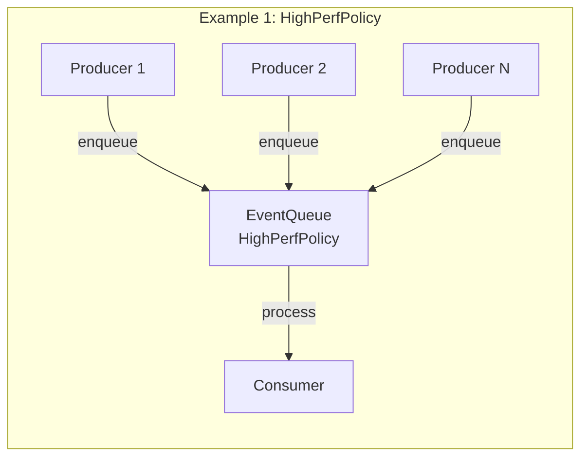
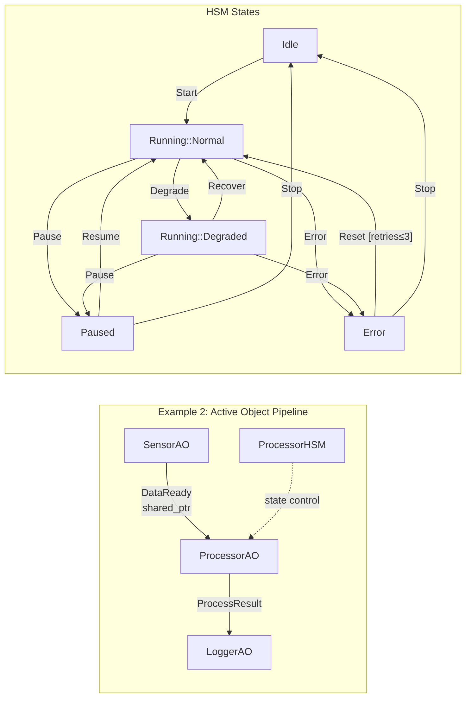
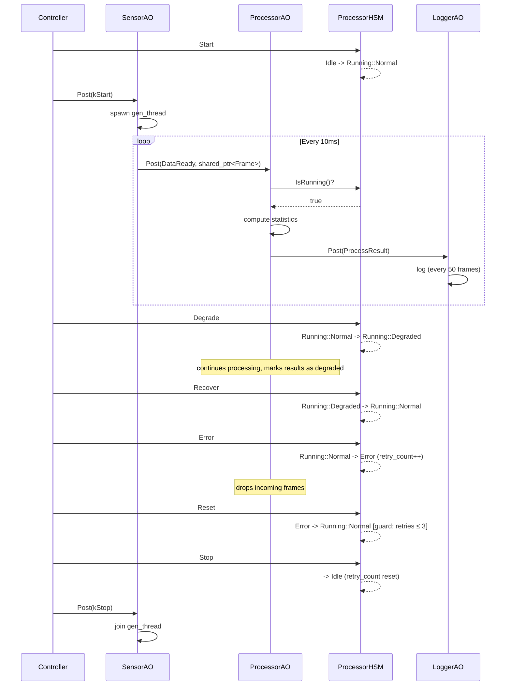

# eventpp Examples 设计文档

> 适用于 eventpp v0.3.0+

---

## 1. 概述

本目录包含两个示例程序，演示 eventpp 在嵌入式实时系统中的典型用法。

| 示例 | 文件 | 核心模式 |
|------|------|----------|
| Example 1 | `example_highperf_eventqueue.cpp` | HighPerfPolicy 基础用法 + MPSC 吞吐量对比 |
| Example 2 | `example_active_object_hsm.cpp` | Active Object pipeline + HSM 状态控制 |

Example 1 是独立示例，不依赖 Example 2。Example 2 在 Example 1 的基础上展示更完整的架构模式。

---

## 2. 架构总览





---

## 3. 组件依赖关系

### 3.1 继承层次

```
ActiveObject (基类: 独立线程 + eventpp EventQueue)
├── SensorAO      — 传感器数据生产者
├── ProcessorAO   — 数据处理器
│   └── ProcessorHSM — 内嵌状态机 (组合关系，非继承)
└── LoggerAO      — 日志记录器
```

### 3.2 数据流 (Pipeline)

```
SensorAO ──DataReady(shared_ptr<Frame>)──> ProcessorAO ──ProcessResult──> LoggerAO
```

- **单向 pipeline**: 每个 AO 只持有下游引用，不知道上游
- SensorAO 构造时接收 `ProcessorAO&` (下游)
- ProcessorAO 构造时接收 `LoggerAO&` (下游)
- LoggerAO 无下游依赖 (pipeline 终点)
- 构造顺序: LoggerAO → ProcessorAO → SensorAO (反向于数据流)

### 3.3 控制流

```
main() ──SendCommand()──> ProcessorAO.ProcessorHSM  (HSM 状态控制)
main() ──Post(Start/Stop)──> SensorAO               (数据生成控制)
```

- 控制流与数据流解耦: main() 直接操作 HSM，不经过事件队列
- HSM 状态决定 ProcessorAO 的行为 (是否处理数据、是否降级)

### 3.4 组合关系

| 拥有者 | 被拥有 | 关系 | 说明 |
|--------|--------|------|------|
| ProcessorAO | ProcessorHSM | 组合 | HSM 嵌入 ProcessorAO，控制其数据处理行为 |
| ActiveObject | EventQueue | 组合 | 每个 AO 拥有独立的 HighPerfPolicy 事件队列 |
| SensorAO | gen_thread | 组合 | 数据生成线程，由 Start/Stop 事件控制生命周期 |

---

## 4. Example 1: HighPerfPolicy EventQueue

### 4.1 目的

- 展示 `HighPerfPolicy` 零配置用法
- 对比 `DefaultPolicies` vs `HighPerfPolicy` 在 MPSC 场景下的吞吐量差异

### 4.2 模块划分

| 模块 | 职责 |
|------|------|
| `example_basic` | 基础 API 演示: appendListener, enqueue, process |
| `example_mpsc` | 多生产者单消费者吞吐量测试, 模板化测量函数 |

### 4.3 关键接口

```cpp
// HighPerfPolicy EventQueue (SpinLock + PoolAllocator + shared_mutex)
eventpp::EventQueue<int, void(const SensorData&), eventpp::HighPerfPolicy> queue;

// 入队 (线程安全, lock-free pool 分配)
queue.enqueue(event_id, payload);

// 批量处理 (单线程消费)
queue.process();
```

### 4.4 线程模型

```
Producer Thread 1 ─┐
Producer Thread 2 ─┤── enqueue() ──> [PoolAllocator CAS] ──> EventQueue
Producer Thread N ─┘
                                                                  │
Consumer Thread  <── process() ──────────────────────────────────┘
```

- `enqueue()`: lock-free CAS 分配 + SpinLock 入队 (短临界区)
- `process()`: 单线程, splice 批量取出后无锁遍历

### 4.5 资源预算

| 资源 | 预算 |
|------|------|
| 栈内存 | SensorData 16B, Message 16B |
| 堆内存 | PoolAllocator slab: 8192 slots x ~64B = ~512KB (首次 enqueue 时分配) |
| 线程数 | 1 consumer + N producers (测试中 N=1 或 4) |

---

## 5. Example 2: Active Object + HSM Pipeline

### 5.1 目的

- 展示 Active Object 模式: 每个组件独立线程 + 事件队列
- 展示层次状态机 (HSM) 控制处理流程:
  - 复合状态: Running 包含 Normal / Degraded 两个子状态
  - Entry/Exit 动作: 状态进入/退出时执行副作用
  - Guard 条件: Error 恢复有重试次数限制
- 展示零拷贝数据传递: `shared_ptr<SensorFrame>` 跨 AO 传递

### 5.2 模块划分

| 模块 | 职责 | 线程 |
|------|------|------|
| `SensorAO` | 生成模拟传感器帧, 发送 DataReady 事件 | 独立生成线程 + AO 线程 |
| `ProcessorAO` | 接收帧数据, 计算统计量, 发送 ProcessResult | AO 线程 |
| `LoggerAO` | 接收处理结果, 周期性打印, 统计降级帧数 | AO 线程 |
| `ProcessorHSM` | 处理器状态控制 (5 状态, 含复合状态) | ProcessorAO 线程内 |

### 5.3 HSM 状态机详解

```
状态                  Entry 动作                   Exit 动作
─────────────────────────────────────────────────────────────
Idle                  reset retry_count            —
Running::Normal       log "processing normally"    —
Running::Degraded     log "degraded mode"          log "leaving degraded"
Paused                log "suspended"              —
Error                 ++retry_count                log "attempting recovery"
```

**Guard 条件**: `Error → Reset → Running::Normal` 仅当 `retry_count <= 3` 时允许，超过限制后 Reset 被拒绝，必须 Stop 回到 Idle 重置计数器。

### 5.4 数据流时序



### 5.5 关键接口

```cpp
// Active Object 基类 (使用 HighPerfPolicy EventQueue)
class ActiveObject {
    void Subscribe(uint32_t event_id, Callback cb);  // 注册事件处理器
    void Post(const EventPayload& event);            // 线程安全投递
    void Start();                                     // 启动 AO 线程
    void Stop();                                      // 停止 AO 线程
};

// 事件载荷 (类型擦除, shared_ptr 生命周期管理)
struct EventPayload {
    template <typename T> EventPayload(uint32_t id, T&& payload);
    template <typename T> const T& Get() const;
};

// HSM 状态控制
class ProcessorHSM {
    bool Dispatch(uint32_t event_id);  // 状态转移 (含 guard 检查)
    bool IsRunning() const;            // Running::Normal || Running::Degraded
    bool IsDegraded() const;           // Running::Degraded only
    uint32_t RetryCount() const;       // 当前重试计数
};
```

### 5.6 线程安全性

| 操作 | 线程安全 | 机制 |
|------|:--------:|------|
| `ActiveObject::Post()` | 是 | eventpp EventQueue (SpinLock) |
| `ActiveObject::Subscribe()` | 否 | 仅在 Start() 前调用 |
| `ProcessorHSM::Dispatch()` | 否 | 仅从 main 线程调用 |
| `SensorFrame` 读取 | 是 | shared_ptr 引用计数, 只读访问 |

### 5.7 资源预算

| 资源 | 预算 |
|------|------|
| SensorFrame | 1052B (栈/堆, shared_ptr 管理) |
| ProcessResult | 20B (值语义, 内联传递) |
| EventQueue pool | 每个 AO 独立 slab: 8192 slots |
| 线程数 | 4 (Sensor AO + gen_thread + Processor AO + Logger AO) |
| 帧率 | ~100 fps (10ms 间隔) |

---

## 6. 编译与运行

```bash
cd examples && mkdir -p build && cd build
cmake .. -DCMAKE_BUILD_TYPE=Release
cmake --build . -j$(nproc)

./example_highperf    # HighPerfPolicy 吞吐量对比
./example_ao_hsm      # Active Object + HSM pipeline
```

### 交叉编译 (ARM-Linux)

```bash
cmake .. -DCMAKE_BUILD_TYPE=Release \
         -DCMAKE_CXX_COMPILER=aarch64-linux-gnu-g++ \
         -DCMAKE_CXX_FLAGS="-O3 -mcpu=cortex-a72"
```

---

## 7. 设计决策

| 问题 | 选择 | 原因 |
|------|------|------|
| AO 内部队列策略 | HighPerfPolicy | SpinLock 短临界区最优, Pool 消除堆抖动 |
| 数据传递方式 | shared_ptr\<Frame\> | 零拷贝, 多消费者安全, 自动释放 |
| HSM 实现 | switch-case + 复合状态 | 状态数适中 (5), 平面展开清晰，无需模板 HSM 框架 |
| 消费者等待策略 | sleep 100us | 平衡延迟与 CPU 占用, 嵌入式场景可调 |
| 事件 ID 类型 | uint32_t | 固定宽度, 可扩展, 与 eventpp 原生兼容 |
